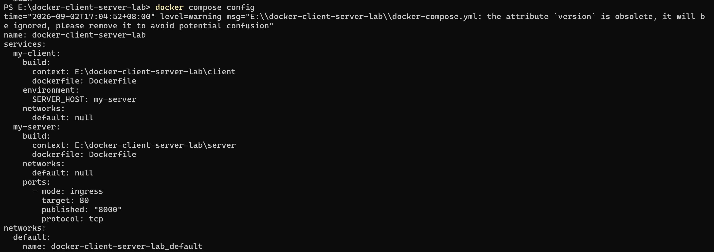
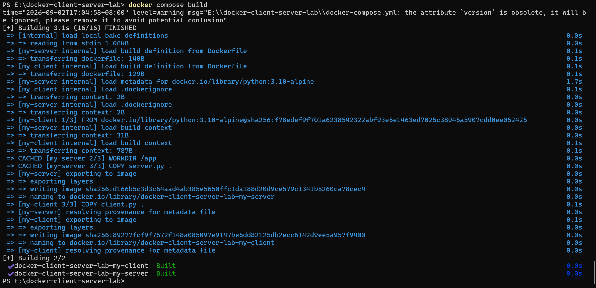

# Docker Client Server Lab

A two-container Python application deployed using Docker and Docker Compose.

## Team Members

- Zahra
- Sara

## Project Goal

Deploy a Python client-server application using two independent Docker containers.

# Docker Client-Server Communication Lab

## معرفی پروژه

در این آزمایش هدف، استقرار یک برنامه ساده کلاینت-سرور پایتونی در محیط Docker است.

این پروژه شامل دو بخش اصلی می‌باشد:

- **Server Application**: برنامه‌ای که با استفاده از ماژول HTTP پایتون روی پورت 80 اجرا شده و منتظر دریافت درخواست‌ها می‌ماند.
- **Client Application**: برنامه‌ای که درخواست‌های HTTP را به سرور ارسال کرده و پاسخ دریافت شده را نمایش می‌دهد.

هدف اصلی این آزمایش، آشنایی عملی با ساخت Docker Image، ایجاد Container، استفاده از Docker Compose و برقراری ارتباط شبکه‌ای بین چند کانتینر مستقل است.

---

# مرحله اول: ایجاد Dockerfile ها

برای هر یک از برنامه‌های سرور و کلاینت، یک Dockerfile جداگانه ایجاد شد.

هر دو Dockerfile از ایمیج پایه سبک زیر استفاده می‌کنند:

```
python:3.10-alpine
```

استفاده از این ایمیج باعث کاهش حجم Image نهایی و اجرای سریع‌تر کانتینرها می‌شود.

---

## Dockerfile سرور

مسیر فایل:

```
server/Dockerfile
```

محتوای فایل:

```dockerfile
FROM python:3.10-alpine

WORKDIR /app

COPY server.py .

EXPOSE 80

CMD ["python", "server.py"]
```

### توضیح دستورات Dockerfile سرور

### FROM

```dockerfile
FROM python:3.10-alpine
```

ایمیج پایه مورد استفاده برای ساخت کانتینر را مشخص می‌کند. در این پروژه از نسخه سبک Python Alpine استفاده شده است.

---

### WORKDIR

```dockerfile
WORKDIR /app
```

مسیر کاری داخل کانتینر را مشخص می‌کند و دستورات بعدی در این مسیر اجرا می‌شوند.

---

### COPY

```dockerfile
COPY server.py .
```

فایل برنامه سرور را از سیستم میزبان به داخل Image منتقل می‌کند.

---

### EXPOSE

```dockerfile
EXPOSE 80
```

مشخص می‌کند که برنامه سرور داخل کانتینر روی پورت 80 در حال اجرا خواهد بود.

---

### CMD

```dockerfile
CMD ["python", "server.py"]
```

دستور پیش‌فرضی است که هنگام اجرای کانتینر اجرا می‌شود و برنامه سرور را راه‌اندازی می‌کند.

---

# Dockerfile کلاینت

مسیر فایل:

```
client/Dockerfile
```

محتوای فایل:

```dockerfile
FROM python:3.10-alpine

WORKDIR /app

COPY client.py .

CMD ["python", "client.py"]
```

این Dockerfile مشابه Dockerfile سرور است، با این تفاوت که فایل اجرایی اصلی، برنامه کلاینت یعنی `client.py` می‌باشد.

---

# مرحله دوم: ایجاد فایل Docker Compose

برای مدیریت همزمان کانتینرهای سرور و کلاینت، فایل زیر ایجاد شد:

```
docker-compose.yml
```

این فایل شامل دو سرویس اصلی است:

- `my-server`
- `my-client`

هر سرویس از Dockerfile مربوط به خود ساخته می‌شود.

---

## سرویس سرور

تنظیمات مربوط به سرور:

```yaml
my-server:
  build:
    context: ./server
  ports:
    - "8000:80"
```

در این بخش:

- مسیر `./server` به عنوان Build Context استفاده می‌شود.
- Dockerfile موجود در پوشه server برای ساخت Image استفاده می‌شود.
- پورت داخلی کانتینر یعنی 80 به پورت 8000 سیستم میزبان متصل می‌شود.

بنابراین پس از اجرای پروژه، سرور از طریق آدرس زیر قابل دسترسی خواهد بود:

```
http://localhost:8000
```

---

## سرویس کلاینت

تنظیمات مربوط به کلاینت:

```yaml
my-client:
  build:
    context: ./client
  environment:
    SERVER_HOST: my-server
```

در این قسمت:

- Dockerfile موجود در پوشه client برای ساخت Image استفاده می‌شود.
- مقدار متغیر محیطی `SERVER_HOST` برابر با نام سرویس سرور قرار داده شده است.

برنامه کلاینت مقدار آدرس سرور را از Environment Variable دریافت می‌کند:

```python
server_host = os.environ.get('SERVER_HOST', 'localhost')
```

بنابراین به جای استفاده از localhost، کلاینت به سرویس:

```
my-server
```

در شبکه داخلی Docker متصل می‌شود.

Docker Compose به صورت خودکار یک شبکه داخلی ایجاد می‌کند که در آن سرویس‌ها می‌توانند با نام یکدیگر را پیدا کنند.

---

# بررسی صحت فایل Docker Compose

برای بررسی صحت تنظیمات فایل Compose از دستور زیر استفاده شد:

```bash
docker compose config
```

خروجی این دستور نشان داد که:

- سرویس‌های `my-server` و `my-client` به درستی شناسایی شده‌اند.
- مسیر Dockerfile ها صحیح است.
- Port Mapping مربوط به سرور درست تنظیم شده است.
- متغیر محیطی `SERVER_HOST` به درستی مقداردهی شده است.

تصویر خروجی:



---

# ساخت Docker Image ها

برای ساخت Image مربوط به هر دو سرویس از دستور زیر استفاده شد:

```bash
docker compose build
```

با اجرای این دستور، Docker Image های مربوط به دو سرویس زیر ساخته شدند:

```
docker-client-server-lab-my-server
```

و

```
docker-client-server-lab-my-client
```

تصویر خروجی:



---

