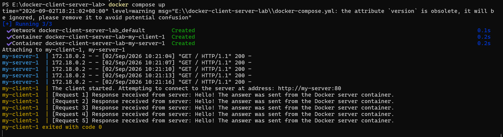
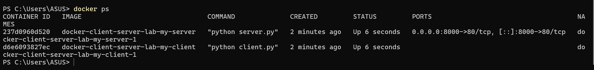
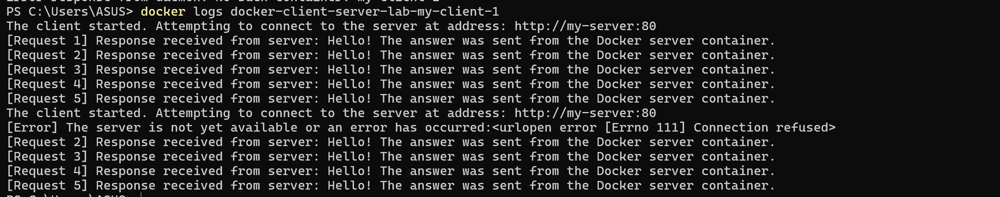
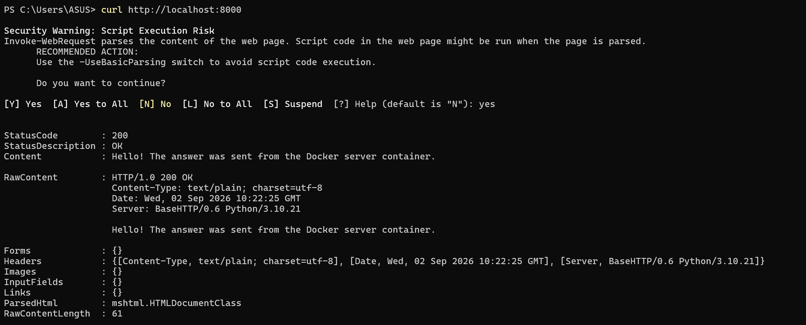
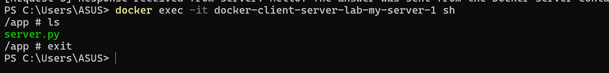

# Docker Client Server Lab

A two-container Python application deployed using Docker and Docker Compose.

## Team Members

- Zahra
- Sara

## Project Goal

Deploy a Python client-server application using two independent Docker containers.

# Docker Client-Server Communication Lab

## معرفی پروژه

در این آزمایش هدف، استقرار یک برنامه ساده کلاینت-سرور پایتونی در محیط Docker است.

این پروژه شامل دو بخش اصلی می‌باشد:

- **Server Application**: برنامه‌ای که با استفاده از ماژول HTTP پایتون روی پورت 80 اجرا شده و منتظر دریافت درخواست‌ها می‌ماند.
- **Client Application**: برنامه‌ای که درخواست‌های HTTP را به سرور ارسال کرده و پاسخ دریافت شده را نمایش می‌دهد.

هدف اصلی این آزمایش، آشنایی عملی با ساخت Docker Image، ایجاد Container، استفاده از Docker Compose و برقراری ارتباط شبکه‌ای بین چند کانتینر مستقل است.

---

# مرحله اول: ایجاد Dockerfile ها

برای هر یک از برنامه‌های سرور و کلاینت، یک Dockerfile جداگانه ایجاد شد.

هر دو Dockerfile از ایمیج پایه سبک زیر استفاده می‌کنند:

```
python:3.10-alpine
```

استفاده از این ایمیج باعث کاهش حجم Image نهایی و اجرای سریع‌تر کانتینرها می‌شود.

---

## Dockerfile سرور

مسیر فایل:

```
server/Dockerfile
```

محتوای فایل:

```dockerfile
FROM python:3.10-alpine

WORKDIR /app

COPY server.py .

EXPOSE 80

CMD ["python", "server.py"]
```

### توضیح دستورات Dockerfile سرور

### FROM

```dockerfile
FROM python:3.10-alpine
```

ایمیج پایه مورد استفاده برای ساخت کانتینر را مشخص می‌کند. در این پروژه از نسخه سبک Python Alpine استفاده شده است.

---

### WORKDIR

```dockerfile
WORKDIR /app
```

مسیر کاری داخل کانتینر را مشخص می‌کند و دستورات بعدی در این مسیر اجرا می‌شوند.

---

### COPY

```dockerfile
COPY server.py .
```

فایل برنامه سرور را از سیستم میزبان به داخل Image منتقل می‌کند.

---

### EXPOSE

```dockerfile
EXPOSE 80
```

مشخص می‌کند که برنامه سرور داخل کانتینر روی پورت 80 در حال اجرا خواهد بود.

---

### CMD

```dockerfile
CMD ["python", "server.py"]
```

دستور پیش‌فرضی است که هنگام اجرای کانتینر اجرا می‌شود و برنامه سرور را راه‌اندازی می‌کند.

---

# Dockerfile کلاینت

مسیر فایل:

```
client/Dockerfile
```

محتوای فایل:

```dockerfile
FROM python:3.10-alpine

WORKDIR /app

COPY client.py .

CMD ["python", "client.py"]
```

این Dockerfile مشابه Dockerfile سرور است، با این تفاوت که فایل اجرایی اصلی، برنامه کلاینت یعنی `client.py` می‌باشد.

---

# مرحله دوم: ایجاد فایل Docker Compose

برای مدیریت همزمان کانتینرهای سرور و کلاینت، فایل زیر ایجاد شد:

```
docker-compose.yml
```

این فایل شامل دو سرویس اصلی است:

- `my-server`
- `my-client`

هر سرویس از Dockerfile مربوط به خود ساخته می‌شود.

---

## سرویس سرور

تنظیمات مربوط به سرور:

```yaml
my-server:
  build:
    context: ./server
  ports:
    - "8000:80"
```

در این بخش:

- مسیر `./server` به عنوان Build Context استفاده می‌شود.
- Dockerfile موجود در پوشه server برای ساخت Image استفاده می‌شود.
- پورت داخلی کانتینر یعنی 80 به پورت 8000 سیستم میزبان متصل می‌شود.

بنابراین پس از اجرای پروژه، سرور از طریق آدرس زیر قابل دسترسی خواهد بود:

```
http://localhost:8000
```

---

## سرویس کلاینت

تنظیمات مربوط به کلاینت:

```yaml
my-client:
  build:
    context: ./client
  environment:
    SERVER_HOST: my-server
```

در این قسمت:

- Dockerfile موجود در پوشه client برای ساخت Image استفاده می‌شود.
- مقدار متغیر محیطی `SERVER_HOST` برابر با نام سرویس سرور قرار داده شده است.

برنامه کلاینت مقدار آدرس سرور را از Environment Variable دریافت می‌کند:

```python
server_host = os.environ.get('SERVER_HOST', 'localhost')
```

بنابراین به جای استفاده از localhost، کلاینت به سرویس:

```
my-server
```

در شبکه داخلی Docker متصل می‌شود.

Docker Compose به صورت خودکار یک شبکه داخلی ایجاد می‌کند که در آن سرویس‌ها می‌توانند با نام یکدیگر را پیدا کنند.

---

# بررسی صحت فایل Docker Compose

برای بررسی صحت تنظیمات فایل Compose از دستور زیر استفاده شد:

```bash
docker compose config
```

خروجی این دستور نشان داد که:

- سرویس‌های `my-server` و `my-client` به درستی شناسایی شده‌اند.
- مسیر Dockerfile ها صحیح است.
- Port Mapping مربوط به سرور درست تنظیم شده است.
- متغیر محیطی `SERVER_HOST` به درستی مقداردهی شده است.

تصویر خروجی:


---

# ساخت Docker Image ها

برای ساخت Image مربوط به هر دو سرویس از دستور زیر استفاده شد:

```bash
docker compose build
```

با اجرای این دستور، Docker Image های مربوط به دو سرویس زیر ساخته شدند:

```
docker-client-server-lab-my-server
```

و

```
docker-client-server-lab-my-client
```

تصویر خروجی:


---


---

# مرحله سوم: اجرای سرویس‌ها و بررسی ارتباط بین کانتینرها

پس از ایجاد Dockerfile ها و فایل Docker Compose، در این مرحله سرویس‌های سرور و کلاینت اجرا و ارتباط بین آن‌ها بررسی شد.

برای اجرای همزمان سرویس‌ها از دستور زیر استفاده شد:

```bash
docker compose up
```

با اجرای این دستور، Docker Compose شبکه داخلی مورد نیاز را ایجاد کرده و کانتینرهای مربوط به سرویس‌های `my-server` و `my-client` را اجرا کرد.

---

## اجرای Docker Compose

پس از اجرای دستور `docker compose up`، سرویس‌های زیر ایجاد شدند:

```
docker-client-server-lab-my-server-1
```

و

```
docker-client-server-lab-my-client-1
```

همچنین شبکه داخلی Docker Compose با نام:

```
docker-client-server-lab_default
```

ایجاد شد.

تصویر اجرای سرویس‌ها:



---

# بررسی وضعیت کانتینرها

برای مشاهده کانتینرهای در حال اجرا از دستور زیر استفاده شد:

```bash
docker ps
```

این دستور وضعیت کانتینرها، Image مورد استفاده و Port Mapping را نمایش می‌دهد.

تصویر خروجی:



---

# بررسی ارتباط Client و Server

برنامه کلاینت آدرس سرور را از طریق متغیر محیطی زیر دریافت می‌کند:

```
SERVER_HOST=my-server
```

بنابراین درخواست‌ها به جای localhost به سرویس Docker با نام:

```
my-server
```

ارسال شدند.

لاگ کلاینت نشان داد که درخواست‌ها با موفقیت ارسال شده و پاسخ از سرور دریافت شده است.

نمونه خروجی:

```
[Request 1] Response received from server:
Hello! The answer was sent from the Docker server container.
```

تا درخواست پنجم ارتباط بدون مشکل برقرار بود.

تصویر لاگ کلاینت:



---

# بررسی دسترسی به سرور از سیستم میزبان

برای بررسی Port Forwarding، درخواست HTTP از سیستم میزبان به آدرس زیر ارسال شد:

```bash
curl http://localhost:8000
```

با توجه به تنظیمات Docker Compose:

```
localhost:8000  --->  container port 80
```

درخواست به کانتینر سرور منتقل شد و پاسخ صحیح دریافت شد.

تصویر خروجی:



---

# بررسی فایل‌های داخل کانتینر سرور

برای ورود به کانتینر سرور از دستور زیر استفاده شد:

```bash
docker exec -it docker-client-server-lab-my-server-1 sh
```

سپس با اجرای دستور:

```bash
ls
```

فایل‌های موجود در مسیر کاری کانتینر مشاهده شدند.

خروجی:

```
server.py
```

این خروجی نشان می‌دهد که فایل برنامه سرور به درستی داخل Image کپی شده و در محیط Container قابل دسترسی است.

تصویر خروجی:



---

# پاسخ پرسش‌های تئوری و مستندسازی نهایی

## 1. وظیفه فایل docker-compose.yml چیست و چه زمانی به جای docker run از آن استفاده می‌کنیم؟

فایل `docker-compose.yml` برای تعریف، پیکربندی و مدیریت چندین سرویس Docker به صورت همزمان استفاده می‌شود.

در این فایل می‌توان مواردی مانند:

- Image یا Dockerfile مورد استفاده هر سرویس
- پورت‌های مورد نیاز
- متغیرهای محیطی (Environment Variables)
- شبکه بین کانتینرها
- Volume ها

را مشخص کرد.

در پروژه حاضر، فایل Compose برای مدیریت دو سرویس مستقل یعنی `my-server` و `my-client` استفاده شد. این فایل باعث می‌شود هر دو کانتینر با یک دستور اجرا شده و بتوانند در یک شبکه داخلی Docker با یکدیگر ارتباط برقرار کنند.

در پروژه‌های کوچک که فقط یک کانتینر داریم، استفاده از دستور `docker run` کافی است. اما زمانی که چندین کانتینر وجود داشته باشد و نیاز به تنظیمات مشترک، شبکه، وابستگی بین سرویس‌ها و مدیریت ساده‌تر داشته باشیم، استفاده از Docker Compose مناسب‌تر است.

---

## 2. Kubernetes چیست و چه رابطه‌ای با Docker دارد؟

Kubernetes یک ابزار مدیریت و ارکستراسیون کانتینرها است که برای مدیریت تعداد زیادی کانتینر در محیط‌های بزرگ استفاده می‌شود.

این ابزار وظایفی مانند Deploy کردن، مقیاس‌دهی، Load Balancing و مدیریت وضعیت کانتینرها را انجام می‌دهد. Docker برای ساخت و اجرای کانتینرها استفاده می‌شود، در حالی که Kubernetes برای مدیریت تعداد زیادی کانتینر Docker در محیط‌های Production کاربرد دارد.

---

## 3. توضیح Image، Container و Volume در Docker

### Image

Image یک قالب یا الگوی Read-only است که شامل فایل‌ها، کتابخانه‌ها، وابستگی‌ها و تنظیمات لازم برای اجرای یک برنامه می‌باشد.

در این پروژه، Image های مربوط به سرور و کلاینت با استفاده از Dockerfile ساخته شدند.

---

### Container

Container یک نمونه در حال اجرای یک Image است.

به عبارت دیگر، Image یک فایل آماده برای اجرا است و Container همان Image در حالت اجرا می‌باشد.

در این پروژه دو Container مستقل برای سرویس‌های:

- `my-server`
- `my-client`

ایجاد شدند.

---

### Volume

Volume روشی برای ذخیره‌سازی دائمی داده‌ها در Docker است.

داده‌هایی که داخل Container ذخیره می‌شوند، با حذف Container از بین می‌روند؛ اما با استفاده از Volume می‌توان داده‌ها را خارج از چرخه عمر Container نگهداری کرد.

Volume معمولاً برای نگهداری اطلاعاتی مانند Database، فایل‌های کاربران و داده‌های مهم استفاده می‌شود.

---

# مستندسازی استفاده از هوش مصنوعی (AI Assistance)

در طول انجام این پروژه، از هوش مصنوعی به عنوان یک ابزار کمکی برای یادگیری مفاهیم، بررسی خطاها، بهبود ساختار پروژه و راهنمایی در استفاده صحیح از Git و Docker استفاده شد.

استفاده از AI شامل تولید مستقیم کل پروژه بدون بررسی نبود، بلکه مراحل مختلف توسط دانشجو اجرا، تست و اعتبارسنجی شدند.

مدل استفاده شده:

```
ChatGPT - GPT-5.5 High
```

نمونه پرامپت‌های استفاده شده:

---

## Prompt 1

```
من می‌خواهم یک پروژه Docker را به صورت تیمی با Git و Hamgit انجام بدهم.
لطفاً از مرحله صفر، ساخت Repository، ایجاد Branch، Commit های معنادار، Push و Merge Request را به صورت گام به گام توضیح بده.
همچنین کمک کن که کار بین دو عضو تیم تقسیم شود و تاریخچه Git شبیه یک پروژه واقعی باشد.
```

---

## Prompt 2

```
من یک پروژه ساده Client-Server با Python دارم که باید بدون تغییر کدهای برنامه داخل Docker اجرا شود.
به من توضیح بده چگونه برای هر بخش Dockerfile بنویسم، Docker Compose ایجاد کنم و ارتباط شبکه‌ای بین دو Container را تنظیم کنم.
لطفاً مرحله به مرحله جلو برو و بعد از هر مرحله خروجی را بررسی کن.
```

---

## Prompt 3

```
من باید گزارش پروژه Docker خودم را داخل README بنویسم.
کمکم کن ساختار گزارش شامل توضیح Dockerfile، docker-compose.yml، Port Mapping، Environment Variable، تست Container ها و پاسخ سوالات تئوری باشد.
متن باید مناسب گزارش دانشگاهی و قابل قرار دادن در GitHub باشد.
```

---

## نحوه استفاده از AI در روند پروژه

AI در این پروژه برای موارد زیر استفاده شد:

- درک مفاهیم Docker و Docker Compose
- بررسی خطاهای Git و Docker
- پیشنهاد Workflow مناسب برای کار تیمی
- بررسی ساختار Branch ها و Commit ها
- کمک در تنظیم مستندات README
